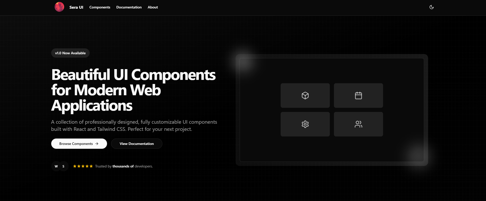
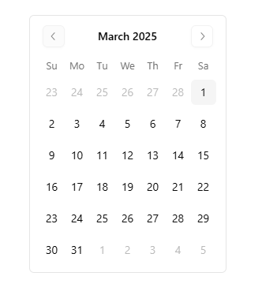
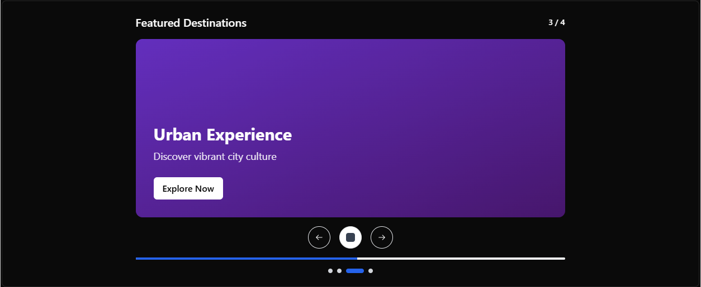
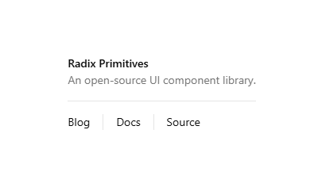

# 🎨 Sera UI Component Library

A modern, extensible React component library built with reusability and developer experience in mind.



## 📚 Overview

This library provides a collection of customizable UI components organized by category to help streamline your development process. Built with React and TypeScript, it offers a consistent design language while maintaining flexibility for your specific needs.

## 🚀 Getting Started

### Installation

```bash
npm install @sera-ui
# or
yarn add @sera-ui
```

### Basic Usage

```jsx
import { Button } from "@sera-ui";

function App() {
  return (
    <div>
      <h1>Hello World</h1>
      <Button>Click Me</Button>
    </div>
  );
}
```

## 🏗️ Library Structure

The component library follows a categorical organization to help you find components quickly:

```
src/lib/
├── components.ts            # Main registry of all components
├── component-creator.ts     # Helper to create components
├── types.ts                 # Type definitions
└── components/              # Component definitions by category
    ├── forms/               # Inputs, buttons, selects, etc.
    ├── navigation/          # Menus, breadcrumbs, tabs, etc.
    ├── layout/              # Grid, containers, dividers, etc.
    ├── data-display/        # Cards, tables, lists, etc.
    ├── feedback/            # Alerts, notifications, progress, etc.
    ├── overlays/            # Modals, tooltips, popovers, etc.
    └── typography/          # Text, headings, paragraphs, etc.
```

## ⚙️ Contributing

### Adding Components to Existing Categories

1. Create a new file in the appropriate category folder:

```tsx
// src/lib/components/forms/my-button.tsx
import React from 'react';
import { Button } from "@/components/ui/button";
import { ComponentExample } from '@/lib/types';
import { createComponent } from '@/lib/component-creator';

export const myButtonExample = createComponent({
  id: 'my-button',
  title: 'My Button',
  description: 'A custom button component',
  category: 'Forms',
  code: `import { Button } from "@/components/ui/button"

export function MyButton() {
  return <Button>My Button</Button>
}`,
  component: React.createElement(Button, {}, "My Button")
});
```

2. Import and add the component to the components registry:

```tsx
// src/lib/components.ts
import { myButtonExample } from './components/forms/my-button';

export const components: ComponentExample[] = [
  // ... existing components
  myButtonExample,
];
```

### Creating New Categories

1. Update the `ComponentCategory` type in `src/lib/types.ts`:

```tsx
export type ComponentCategory =
  | 'Forms'
  | 'Navigation'
  | 'Layout'
  | 'Data Display'
  | 'Feedback'
  | 'Overlays'
  | 'Typography'
  | 'MyNewCategory'; // Add your new category here

// Also update the categories array
export const categories: ComponentCategory[] = [
  'Forms',
  'Navigation',
  'Layout',
  'Data Display',
  'Feedback',
  'Overlays',
  'Typography',
  'MyNewCategory', // Add your new category here
];
```

2. Create a new folder for your category and add components following the pattern above.

## 🖼️ Component Showcase

Here are some examples of components available in our library:

### Calendar


### Carousel


### Separator


## 📖 Documentation

For full documentation, visit our [documentation site](https://your-component-library-docs.com).

### Example: Breadcrumb Component

```tsx
import { Breadcrumb } from "@/ui/navigation";

function Page() {
  return (
    <Breadcrumb>
      <Breadcrumb.Item href="/">Home</Breadcrumb.Item>
      <Breadcrumb.Item href="/category">Category</Breadcrumb.Item>
      <Breadcrumb.Item>Current Page</Breadcrumb.Item>
    </Breadcrumb>
  );
}
```

Result:


## 🧪 Testing

We use Jest and React Testing Library for testing components:

```bash
# Run all tests
npm test

# Run specific component tests
npm test -- -t "Button"
```

## 📋 Component Checklist

When creating a new component, ensure it meets these requirements:

- [ ] Proper TypeScript typing
- [ ] Responsive design
- [ ] Accessibility (ARIA attributes, keyboard navigation)
- [ ] Theme compatibility
- [ ] Unit tests
- [ ] Documentation
- [ ] Examples

## 🔄 Version Control

We follow semantic versioning:

- Major version: Breaking changes
- Minor version: New features (non-breaking)
- Patch version: Bug fixes and minor improvements

## 📜 License

MIT © [Sera Corporation]
